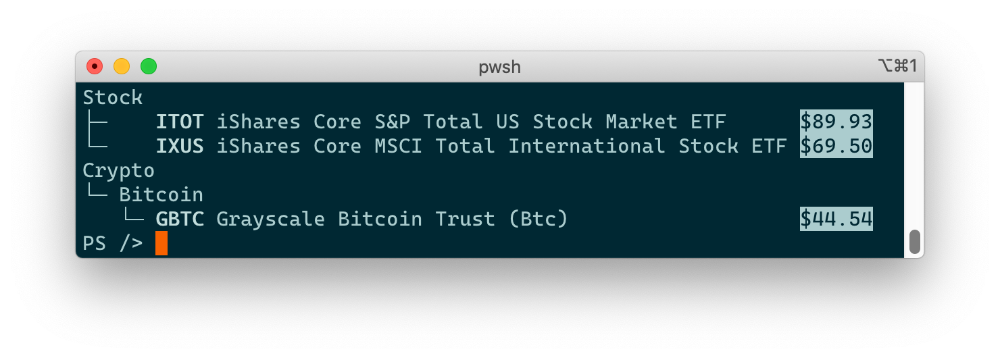

<!-- PROJECT LOGO -->
<!-- markdownlint-disable MD033 MD041 -->
<p align="center">
  <a href="https://github.com/yoannchaudet/hospitable">
    
  </a>
</p>

 [](https://codecov.io/gh/yoannchaudet/hospitable)

## Table of Contents

- [Table of Contents](#table-of-contents)
- [About The Project](#about-the-project)
- [Built With](#built-with)
- [Getting Started](#getting-started)
- [Usage and Examples](#usage-and-examples)
  - [Text Formatting](#text-formatting)
  - [Get-Lists](#get-lists)
  - [Get-Tree](#get-tree)
- [License](#license)
- [Contact](#contact)

## About The Project

A good host is said to be *hospitable*. I like bad puns so this project which contains a set of PowerShell [cmdlets][cmdlets] (in the form of [advanced functions][advanced-functions]) for printing stuff on terminal/console is perfectly named.

This project supports PowerShell 7+ and is compatible with Windows 10+, MacOS and Linux. Because most pretty outputs rely on [virtual terminal sequences (based on VT-100)][vt-100], older versions of Windows are not supported.

## Built With

- [PowerShell][powershell], a great (and now interoperable!) scripting language
- [Pester][pester], a test framework for PowerShell

## Getting Started

To get started, follow these steps:

- Install [PowerShell][powershell]

- In a PowerShell prompt, install the latest version from the PowerShell Gallery with:

   ```powershell
  Install-Module Hospitable -Scope CurrentUser
   ```

- Or in any shell, get yourself a local development environment with:

   ```sh
   # Install build dependencies
   ./install-build-dependencies.ps1

   # Run tests
   ./build.ps1 Test

   # Import the local module in the current shell (so cmdlets can be called)
   ./build.ps1 Import
   ```

## Usage and Examples

The following examples can be run in a PowerShell prompt.

### Text Formatting

The following text formatting is supported:

```powershell
# Bold, underline and negative formats
Get-Bold bold
Get-Underline underline
Get-Negative negative

# Strike through (available in PowerShell v7.2.0-preview.3 +)
# See https://github.com/PowerShell/PowerShell/pull/14461
Get-StrikeThrough strikethrough

# They can be combined too (e.g. using pipes)
'hello there' | Get-Bold | Get-Underline
```


### Get-Lists

Format a list (of lists).

```powershell
# A 3-element list including a nested list
Get-Lists 'item 1', @('sub group item 1', 'sub group item 2'), 'item 3'

# With some formatting
Get-Lists ('item 1' | Get-Underline), ('item 2' | Get-Underline)
```


### Get-Tree

Format a tree.

```powershell
Get-Tree {
  Node 'Fruits' {
    Node '🥝 Kiwi'
    Node '🥭 Mango'
    Node '🍌 Banana'
  }

  Node 'Vegetables' {
    Node '🥕 Carrot'
    Node '🥔 Potato'
  }
}
```


A tree is specified using a simple [domain-specific language (DSL)][dsl] and it supports the following extra features:

1. A node may have multiple columns (that are displayed as space-separated strings)
2. Columns can be aligned (left, right and centered)
3. Nodes can have their column aligned together into "alignment groups", by default all nodes are part of the `0` alignment group

Here are few examples showcasing these features.

```powershell
Get-Tree {
  Node 'Stock' {
    # Align the first column (0-indexed) of all children (recursively) to the right
    ChildrenColumnAlignment 0 'Right'
    Node (Get-Bold 'ITOT'), 'iShares Core S&P Total US Stock Market ETF', (Get-Negative '$89.93')
    Node (Get-Bold 'IXUS'), 'iShares Core MSCI Total International Stock ETF', (Get-Negative '$69.50')
  }

  Node 'Crypto' {
    Node 'Bitcoin' {
      Node (Get-Bold 'GBTC'), 'Grayscale Bitcoin Trust (Btc)', (Get-Negative '$44.54') {
        # Specifically align the first column to the left
        ColumnAlignment 0 'Right'
      }
    }
  }
}
```



```powershell
Get-Tree {
  Node 'Show', 'Year'
  Node 'Episode', 'Title', 'Rating' {
    ColumnAlignment 0 'Right'

    # Specifically group this node in the alignment group 1 (instead of the default which is 0)
    AlignmentGroup 1
  }

  Node ("The Queen's Gambit" | Get-Bold), '2020' {
    Node 'Season 1' {
      # Group all children nodes in the alignment group 1
      ChildrenAlignmentGroup 1

      Node 'Ep1', 'Openings', '8.5/10'
      Node 'Ep2', 'Exchanges', '8.8/10'
      Node 'Ep3', 'Doubled Pawns', '8.5/10'
      Node 'Ep4', 'Middle Game', '8.5/10'
      Node 'Ep5', 'Fork', '8.3/10'
      Node 'Ep6', 'Adjournment', '8.5/10'
      Node 'Ep7', 'End Game', '9.3/10'
    }
  }

  Node ('Pushing Daisies' | Get-Bold), '2007–2009' {
    Node 'Season 1' {
      ChildrenAlignmentGroup 1

      Node 'Ep1', 'Pie-lette', '8.8/10'
      Node 'Ep2', 'Dummy', '8.2/10'
      Node 'Ep3', 'The Fun in Funeral', '8.3/10'
      Node 'Ep4', 'Pigeon', '8.4/10'
      Node 'Ep5', 'Girth', '8.3/10'
      Node 'Ep6', 'Bitches', '8.2/10'
      Node 'Ep7', 'Smell of Success', '8.3/10'
      Node 'Ep8', 'Bitter Sweets', '8.6/10'
      Node 'Ep9', 'Corpsicle', '8.6/10'
    }

    Node 'Season 2' {
      ChildrenAlignmentGroup 1

      Node 'Ep1', 'Bzzzzzzzzz!', '8.5/10'
      Node 'Ep2', 'Circus', '8.4/10'
      Node 'Ep3', 'Bad Habits', '8.4/10'
      Node 'Ep4', 'Frescorts', '8.5/10'
      Node 'Ep5', 'Dim Sum Lose Some', '8.6/10'
      Node 'Ep6', "Oh Oh Oh... It's Magic", '8.7/10'
      Node 'Ep7', 'Robbing Hood', '8.3/10'
      Node 'Ep8', 'Comfort Food', '9.0/10'
      Node 'Ep9', 'The Legend of Merle McQuoddy', '8.4/10'
      Node 'Ep10', 'The Norwegians', '8.8/10'
      Node 'Ep11', 'Window Dressed to Kill', '8.8/10'
      Node 'Ep12', 'Water & Power', '8.6/10'
      Node 'Ep13', 'Kerplunk', '8.9/10'
    }
  }
}
```


## License

Distributed under the MIT License. See [`LICENSE`](./LICENSE) for more information.

## Contact

[Project link][hospitable-at-github]

<!-- MARKDOWN LINKS -->
[hospitable-at-github]: https://github.com/yoannchaudet/hospitable
[advanced-functions]:https://docs.microsoft.com/en-us/powershell/module/microsoft.powershell.core/about/about_functions_advanced?view=powershell-7.1
[cmdlets]:https://docs.microsoft.com/en-us/powershell/scripting/developer/cmdlet/cmdlet-overview?view=powershell-7.1
[pester]: https://pester.dev/
[powershell]: https://github.com/PowerShell/PowerShell
[vt-100]: https://docs.microsoft.com/en-us/windows/console/console-virtual-terminal-sequences
[dsl]: https://en.wikipedia.org/wiki/Domain-specific_language