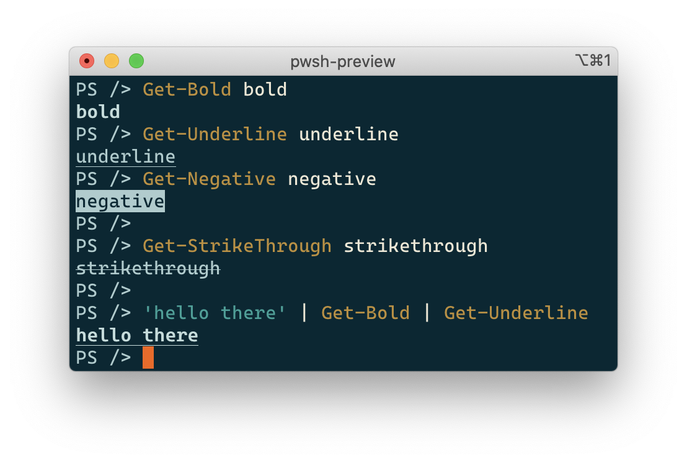

<!-- PROJECT LOGO
     https://www.patorjk.com/software/taag/#p=display&f=Standard&t=hospitable
-->
<!-- markdownlint-disable MD040 -->
<!-- markdownlint-disable MD041 -->
```
 _                     _ _        _     _
| |__   ___  ___ _ __ (_) |_ __ _| |__ | | ___
| '_ \ / _ \/ __| '_ \| | __/ _` | '_ \| |/ _ \
| | | | (_) \__ \ |_) | | || (_| | |_) | |  __/
|_| |_|\___/|___/ .__/|_|\__\__,_|_.__/|_|\___|
                |_|
```

## Table of Contents

- [Table of Contents](#table-of-contents)
- [About The Project](#about-the-project)
- [Built With](#built-with)
- [Getting Started](#getting-started)
- [Usage and Examples](#usage-and-examples)
  - [Text Formatting](#text-formatting)
- [License](#license)
- [Attributions](#attributions)
- [Contact](#contact)

## About The Project

A good host is said to be *hospitable*, as such this project contains a set of PowerShell [cmdlets][cmdlets] (in the form of [advanced functions][advanced-functions]) for printing stuff on terminal/console.

This project supports PowerShell 7+ and is compatible with Windows 10+, with MacOS and Linux. Because most pretty outputs rely on [virtual terminal sequences (based on VT-100)][vt-100], older versions of Windows are not supported.

## Built With

- [PowerShell][powershell], a great (and now interoperable!) scripting language
- [Pester][pester], a test framework for PowerShell

## Getting Started

To run locally follow these steps:

- Install [PowerShell][powershell]

- Then run the following commands from the root of this repository:

   ```ps
   # Install build dependencies
   ./install-build-dependencies.ps1

   # Run tests
   ./build.ps1 Test

   # Import the local module in the current shell (so cmdlets can be called)
   ./build.ps1 Import
   ```

## Usage and Examples

### Text Formatting

The three following formatting are supported:

```ps
# Bold, underline and negative formats
Get-Bold bold
Get-Underline underline
Get-Negative negative

# They can be combined too in pipes
'hello there' | Get-Bold | Get-Underline
```



## License

Distributed under the MIT License. See [`LICENSE`](./LICENSE) for more information.

## Attributions

- www.patorjk.com for the sweet ASCII logo

<!-- CONTACT -->
## Contact

Project link: https://github.com/yoannchaudet/hospitable.

<!-- ACKNOWLEDGEMENTS
## Acknowledgements

* []()
* []()
* []()
-->

<!-- MARKDOWN LINKS & IMAGES -->
<!-- https://www.markdownguide.org/basic-syntax/#reference-style-links -->
[advanced-functions]:https://docs.microsoft.com/en-us/powershell/module/microsoft.powershell.core/about/about_functions_advanced?view=powershell-7.1
[cmdlets]:https://docs.microsoft.com/en-us/powershell/scripting/developer/cmdlet/cmdlet-overview?view=powershell-7.1
[pester]: https://pester.dev/
[powershell]: https://github.com/PowerShell/PowerShell
[vt-100]: https://docs.microsoft.com/en-us/windows/console/console-virtual-terminal-sequences