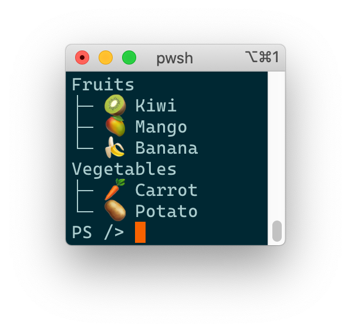

<!-- PROJECT LOGO
     https://www.patorjk.com/software/taag/#p=display&f=Standard&t=hospitable
-->
<!-- markdownlint-disable MD040 -->
<!-- markdownlint-disable MD041 -->
```
 _                     _ _        _     _
| |__   ___  ___ _ __ (_) |_ __ _| |__ | | ___
| '_ \ / _ \/ __| '_ \| | __/ _` | '_ \| |/ _ \
| | | | (_) \__ \ |_) | | || (_| | |_) | |  __/
|_| |_|\___/|___/ .__/|_|\__\__,_|_.__/|_|\___|
                |_|
```

## Table of Contents

- [Table of Contents](#table-of-contents)
- [About The Project](#about-the-project)
- [Built With](#built-with)
- [Getting Started](#getting-started)
- [Usage and Examples](#usage-and-examples)
  - [Text Formatting](#text-formatting)
  - [Get-Lists](#get-lists)
  - [Get-Tree](#get-tree)
- [License](#license)
- [Attributions](#attributions)
- [Contact](#contact)

## About The Project

A good host is said to be *hospitable*, as such this project contains a set of PowerShell [cmdlets][cmdlets] (in the form of [advanced functions][advanced-functions]) for printing stuff on terminal/console.

This project supports PowerShell 7+ and is compatible with Windows 10+, with MacOS and Linux. Because most pretty outputs rely on [virtual terminal sequences (based on VT-100)][vt-100], older versions of Windows are not supported.

## Built With

- [PowerShell][powershell], a great (and now interoperable!) scripting language
- [Pester][pester], a test framework for PowerShell

## Getting Started

To run locally follow these steps:

- Install [PowerShell][powershell]

- Then run the following commands from the root of this repository:

   ```sh
   # Install build dependencies
   ./install-build-dependencies.ps1

   # Run tests
   ./build.ps1 Test

   # Import the local module in the current shell (so cmdlets can be called)
   ./build.ps1 Import
   ```

## Usage and Examples

### Text Formatting

The three following formatting are supported:

```powershell
# Bold, underline and negative formats
Get-Bold bold
Get-Underline underline
Get-Negative negative

# They can be combined too in pipes
'hello there' | Get-Bold | Get-Underline
```


### Get-Lists

Format a list (of lists).

```powershell
# A 3-element list including a nested list
Get-Lists 'item 1', @('sub group item 1', 'sub group item 2'), 'item 3'

# With some formatting
Get-Lists ('item 1' | Get-Underline), ('item 2' | Get-Underline)
```


### Get-Tree

Format a tree.

```powershell
# Build a tree
$tree = New-Tree
$fruits = $tree.AddChild('Fruits')
@('🥝 Kiwi', '🥭 Mango', '🍌 Banana') | ForEach-Object {
  # Add some children to the fruits root (Out-Null not to pollute stdout where each node would be printed when returned)
  $fruits.AddChild($_) | Out-Null
}
$vegetables = $tree.AddChild('Vegetables')
@('🥕 Carrot', '🥔 Potato') | ForEach-Object {
  $vegetables.AddChild($_) | Out-Null
}

# Get the tree
Get-Tree $tree
```



In addition, the following complex formatting are supported:

- A node may have multiple columns (i.e. space-separated strings)
- Columns can be aligned (left, right, centered), the alignment is inherited from parent to children and can be overridden
- Columns are padded to the longest column of nodes under a same parent, this behavior can be overridden with groups (WIP rename)

```powershell
# Build the tree
$tree = New-Tree '2021-03-25'
$tree.SetColumnAlignment(2, 'Right')
$stock = $tree.AddChild('Stock')
$itot = $stock.AddChild(@((Get-Bold 'ITOT'), 'iShares Core S&P Total US Stock Market ETF', (Get-Negative '$89.93')))
$ixus = $stock.AddChild(@((Get-Bold 'IXUS'), 'iShares Core MSCI Total International Stock ETF', (Get-Negative '$69.50')))
$crypto = $tree.AddChild('Crypto')
$btc = $crypto.AddChild('Bitcoin')
$gbtc = $btc.AddChild(@((Get-Bold 'GBTC'), 'Grayscale Bitcoin Trust (Btc)', (Get-Negative '$44.54')))
@($itot, $ixus, $gbtc) | ForEach-Object { $_.SetColumnAlignment(0, 'Right') }

# Get the tree
Get-Tree $tree
```

WIP: This looks very weird. Let's fix it. The way we do alignment is coming from Souvenirs and it does not make much sense here. Proposal:

- always align nodes under a same parent (i.e. all children) - stop doing it for all nodes at the same depth (which is more complicated to compute...)
- replace `New-Tree` by `New-Tree` (which will return an empty root so we don't have to do it in `Get-Tree`), adding children will be needed under the root
- in Get-Tree add an option to pass a list of list of nodes to align together, e.g. `Get-Tree $tree -AlignmentGroups ,@($stock, $gbtc)`

🎉

## License

Distributed under the MIT License. See [`LICENSE`](./LICENSE) for more information.

## Attributions

- www.patorjk.com for the sweet ASCII logo

<!-- CONTACT -->
## Contact

Project link: https://github.com/yoannchaudet/hospitable.

<!-- ACKNOWLEDGEMENTS
## Acknowledgements

* []()
* []()
* []()
-->

<!-- MARKDOWN LINKS & IMAGES -->
<!-- https://www.markdownguide.org/basic-syntax/#reference-style-links -->
[advanced-functions]:https://docs.microsoft.com/en-us/powershell/module/microsoft.powershell.core/about/about_functions_advanced?view=powershell-7.1
[cmdlets]:https://docs.microsoft.com/en-us/powershell/scripting/developer/cmdlet/cmdlet-overview?view=powershell-7.1
[pester]: https://pester.dev/
[powershell]: https://github.com/PowerShell/PowerShell
[vt-100]: https://docs.microsoft.com/en-us/windows/console/console-virtual-terminal-sequences
