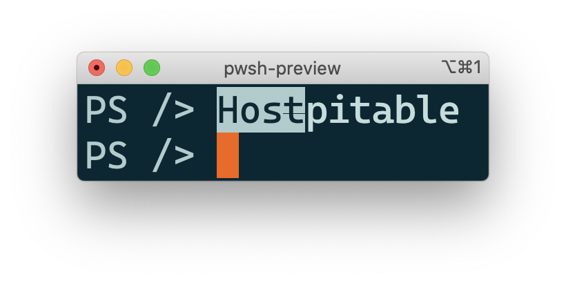

<!-- PROJECT LOGO -->
<!-- markdownlint-disable MD033 MD041 -->
<p align="center">
  <a href="https://github.com/yoannchaudet/hospitable">
    
  </a>
</p>

## Table of Contents

- [Table of Contents](#table-of-contents)
- [About The Project](#about-the-project)
- [Built With](#built-with)
- [Getting Started](#getting-started)
- [Usage and Examples](#usage-and-examples)
  - [Text Formatting](#text-formatting)
  - [Get-Lists](#get-lists)
  - [Get-Tree](#get-tree)
- [License](#license)
- [Contact](#contact)

## About The Project

A good host is said to be *hospitable*. I like bad puns so this project which contains a set of PowerShell [cmdlets][cmdlets] (in the form of [advanced functions][advanced-functions]) for printing stuff on terminal/console is perfectly named.

This project supports PowerShell 7+ and is compatible with Windows 10+, MacOS and Linux. Because most pretty outputs rely on [virtual terminal sequences (based on VT-100)][vt-100], older versions of Windows are not supported.

## Built With

- [PowerShell][powershell], a great (and now interoperable!) scripting language
- [Pester][pester], a test framework for PowerShell

## Getting Started

To run locally follow these steps:

- Install [PowerShell][powershell]

- Then run the following commands from the root of this repository:

   ```sh
   # Install build dependencies
   ./install-build-dependencies.ps1

   # Run tests
   ./build.ps1 Test

   # Import the local module in the current shell (so cmdlets can be called)
   ./build.ps1 Import
   ```

## Usage and Examples

### Text Formatting

The following text formatting is supported:

```powershell
# Bold, underline and negative formats
Get-Bold bold
Get-Underline underline
Get-Negative negative

# Strike through (available in PowerShell v7.2.0-preview.3 +)
# See https://github.com/PowerShell/PowerShell/pull/14461
Get-StrikeThrough strikethrough

# They can be combined too (e.g. using pipes)
'hello there' | Get-Bold | Get-Underline
```


### Get-Lists

Format a list (of lists).

```powershell
# A 3-element list including a nested list
Get-Lists 'item 1', @('sub group item 1', 'sub group item 2'), 'item 3'

# With some formatting
Get-Lists ('item 1' | Get-Underline), ('item 2' | Get-Underline)
```


### Get-Tree

Format a tree.

```powershell
#
# Build a tree
#

# Note the Out-Null not to pollute the output since
# AddChild returns the child tree node
$tree = New-Tree
$fruits = $tree.AddChild('Fruits')
'🥝 Kiwi', '🥭 Mango', '🍌 Banana' | ForEach-Object {
  $fruits.AddChild($_)
} | Out-Null
$vegetables = $tree.AddChild('Vegetables')
'🥕 Carrot', '🥔 Potato' | ForEach-Object {
  $vegetables.AddChild($_)
} | Out-Null

# And render it
Get-Tree $tree
```


More complex scenarios are also supported:

1. A node may have multiple columns (i.e. space-separated strings)

2. Columns can be aligned (left, right, centered),
  the alignment is inherited from parent to children and can be overridden

3. Columns are padded to the longest column of nodes under a same parent,
  this behavior can be overridden with groups

```powershell
#
# Build a tree
#

$tree = New-Tree '2021-03-25'
# Set the third column (0-indexed) of all nodes to be right aligned
$tree.SetColumnAlignment(2, 'Right')
$stock = $tree.AddChild('Stock')
# Add nodes using 3 columns and text formatting
$itot = $stock.AddChild(@((Get-Bold 'ITOT'), 'iShares Core S&P Total US Stock Market ETF', (Get-Negative '$89.93')))
$ixus = $stock.AddChild(@((Get-Bold 'IXUS'), 'iShares Core MSCI Total International Stock ETF', (Get-Negative '$69.50')))
$crypto = $tree.AddChild('Crypto')
$btc = $crypto.AddChild('Bitcoin')
$gbtc = $btc.AddChild(@((Get-Bold 'GBTC'), 'Grayscale Bitcoin Trust (Btc)', (Get-Negative '$44.54')))
# Replace the default alignment (left) for the first column (0-indexed) of the three three-column nodes
$itot, $ixus, $gbtc | ForEach-Object {
  $_.SetColumnAlignment(0, 'Right')
}

# Render the tree
Get-Tree $tree
```


Notice the `ITOT` and `IXUS` nodes have their columns padded together (so the $ amounts on the right are aligned properly). This is a demonstration of the third scenario described above.

In order to pad together the leave-nodes they can be put together in an alignment group:

```powershell
# Render the tree with one alignment group
# Note the syntax here which is required to pass a two-dimension array containing a single array (group)
Get-Tree $tree -AlignmentGroups @(,@($itot, $ixus, $gbtc))
```


## License

Distributed under the MIT License. See [`LICENSE`](./LICENSE) for more information.

## Contact

[Project link][hospitable-at-github]

<!-- MARKDOWN LINKS -->
[hospitable-at-github]: https://github.com/yoannchaudet/hospitable
[advanced-functions]:https://docs.microsoft.com/en-us/powershell/module/microsoft.powershell.core/about/about_functions_advanced?view=powershell-7.1
[cmdlets]:https://docs.microsoft.com/en-us/powershell/scripting/developer/cmdlet/cmdlet-overview?view=powershell-7.1
[pester]: https://pester.dev/
[powershell]: https://github.com/PowerShell/PowerShell
[vt-100]: https://docs.microsoft.com/en-us/windows/console/console-virtual-terminal-sequences
